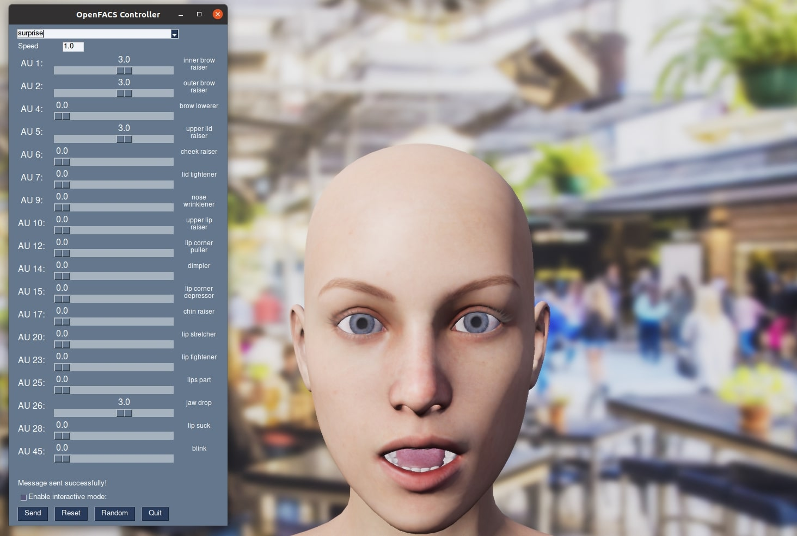

# openFACS : an open source FACS-based 3D face animation system

***Vittorio Cuculo, Alessandro D'Amelio***  
[PHuSe Lab](https://phuselab.di.unimi.it) - Dipartimento di Informatica, Università degli Studi di Milano  

**Paper** Cuculo, V., & D’Amelio, A. (2019, August). OpenFACS: an open source FACS-based 3D face animation system. In *International Conference on Image and Graphics* (pp. 232-242). Springer, Cham.  
https://rd.springer.com/chapter/10.1007/978-3-030-34110-7_20

## Description 
OpenFACS is an open source FACS-based 3D face animation system. OpenFACS is a software that allows the simulation of realistic facial expressions through the manipulation of specific action units as defined in the Facial Action Coding System. OpenFACS has been developed together with an API which is suitable to generate real-time dynamic facial expressions for a three-dimensional character. It can be easily embedded in existing systems without any prior experience in computer graphics.

## Video
[](https://www.youtube.com/watch?v=fzMYU-9qYaw "openFACS model")

## Executing the demo
 
### Linux
To launch the openFACS application:

1. Download the tar file:
```
wget https://github.com/phuselab/openFACS/releases/download/1.0.1/openFACS_Linux.tar.gz
```
2. Untar the package
```
tar xvf openFACS_Linux.tar.gz
```
3. Make the script executable:
```
chmod +x ActionUnitsFace.sh
```
3. Run it:
```
./ActionUnitsFace.sh
```
4. This will open an UDP server on localhost, port 5000.

The 3D model is reachable by sending a JSON message formatted as follows, where the labels are self-explaining:
```
{
    'AU1': 0, 'AU2': 0, 'AU4': 0, 'AU5': 0, 'AU6': 0,
    'AU7': 5, 'AU9': 0, 'AU10': 0, 'AU12': 0, 'AU14': 3,
    'AU15': 0, 'AU17': 0, 'AU20': 0, 'AU23': 0, 'AU25': 0,
    'AU26': 5, 'AU28': 0, 'AU45': 0, 'Speed': 0.05
}
```

Folder `python/` does contain an API accessible via scripts in `demo/` folder, that reflect prototypical facial expressions: anger, contempt, disgust, fear, happiness, neutral, sadness, shock, surprise.
As example, `demo/sadness.py`:

    from openFACS import sendAUS
    AU = [5,0,5,0,0,0,0,0,0,0,5,3,0,0,0,0,0,0]
    sendAUS(AU,0.05)

Alternatively, the folder `python/` also contains a [script](python/gui.py) that launches a simple GUI
that can be used to interact intuitively with the animation.


## Hotkeys
:one: - Turn off all livingness effects  
:two: - Turn on all livingness effects  
:three: - Toggle Blinking  
:four: - Toggle Neck movements  
:five: - Toggle Mouth movements  
:six: - Toggle Eyes movements  
F11 - Toggle Fullscreen  

## Build
Folder `source/` does contain the Unreal Engine 4 project to re-build the application.

## Reference

If you use this code or data, please cite the paper:

```
@inproceedings{cuculo2019openfacs,
    author="Cuculo, Vittorio and D'Amelio, Alessandro",
    editor="Zhao, Yao and Barnes, Nick and Chen, Baoquan and Westermann, R{\"u}diger and Kong, Xiangwei and Lin, Chunyu",
    title="OpenFACS: An Open Source FACS-Based 3D Face Animation System",
    booktitle="Image and Graphics",
    year="2019",
    publisher="Springer International Publishing",
    address="Cham",
    pages="232--242",
}
```

## License

This project is licensed under the MIT License - see the [LICENSE](LICENSE) file for details

## Acknowledgments

We gratefully acknowledge the support of Stefano Palma for the the development of the graphical part and NVIDIA Corporation with the donation of the Quadro P6000 GPU used for this research.


